# 面向 RustOS 的进程调试能力构建 — 科研实践答辩（20 页、图文版）

> **用途**：科研实践答辩（限时 5 分钟）。每页 = 一张幻灯片：一张精美架构图 + 2~3 条讲解要点，弱化代码细节、强调整体框架。
> **配图**：均由 `assets/*.dot` 经 Graphviz 渲染（`assets/*.png`），可直接拖入 PPT；中文字体 PingFang SC。
> **节奏建议（5 min）**：每节用开头页过渡；重点讲第 7、8、13、14 页（总体架构、状态机、断点、安全）与第 16 页实机演示，其余快速带过。
> review 通过后即可一页一页转 PPT。配套 `附录-逐页详稿与代码核对.md` 为讲稿底稿（含源码位置核对），答辩时不展示。

---

## 第 1 页 — 封面

# 面向 RustOS 的进程调试能力构建
### 在 Asterinas 上原生支持 GDB / strace 的 ptrace 子系统

- 2026 全国大学生计算机系统能力大赛、操作系统设计赛（全国）
- OS 功能挑战赛道、proj9
- 汇报人 / 日期 / 指导老师

> 视觉建议：深色科技感封面，中央放一张「GDB ↔ Asterinas 内核」的呼应图标。

---

## 第 2 页 — 目录

| | 章节 | 关键词 |
|---|---|---|
| **PART 1** | 研究背景与目标 | 问题定义、总体目标 |
| **PART 2** | 核心设计 | 总体架构、状态机、内存、寄存器、安全 |
| **PART 3** | 实现与验证 | 实机演示、测试体系 |
| **PART 4** | 总结与展望 | 项目价值、后续方向 |

> 视觉建议：四个彩色卡片配图标，与正文配色一致（蓝/绿/橙/紫）。

---

## 第 3 页 — PART 1 开篇

# PART 1　研究背景与目标
### 用户调试能力构建的背景、意义与目标

---

## 第 4 页 — 1.1 研究背景与问题定义

Asterinas 是一个用 Rust 编写、与 Linux ABI 兼容的操作系统内核，能直接运行 Linux 程序，并借助 Rust 框内核架构提升内核可靠性。

面向开发者的操作系统不能只支持运行应用程序，还要让开发者能调试应用程序。GDB、strace 都依赖内核的 ptrace 机制，提供了良好的实用性。

难点在于：进程调试不是单个系统调用，而是贯穿进程管理、信号、wait、地址空间、寄存器、安全与 procfs 的完整通路。本项目要在 Asterinas 上，从零构建一套兼容、安全、能正确运行真实调试器的调试子系统。

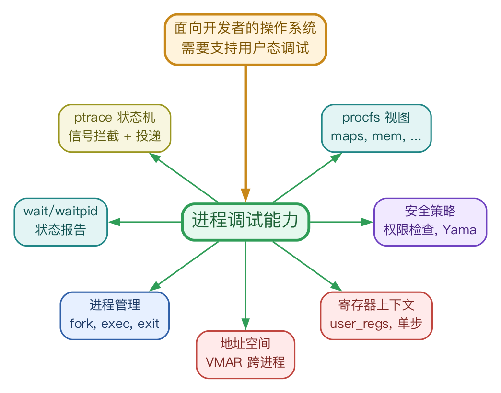

---

## 第 5 页 — 1.2 总体目标与对应内核能力

要让开发者能使用 GDB / strace 调试用户程序，内核必须补齐的能力有：

| 总体目标 | 对应内核能力 |
|---|---|
| GDB 调试 | 建立 tracer / tracee 关系，使能 tracee 陷入内核 stop，并等待 tracer wait & resume |
| 设置并命中软件断点 | 使能修改只读内存写入 breakpoint，#BP 异常后进入 ptrace-stop |
| 读 / 写寄存器 | tracee stop 时保存 register 现场，按字段规则安全读写 |
| 读 / 写进程内存 | 跨进程安全读写目标地址空间，必要时主动触发 page fault |
| 继续 / 单步 | resume 继续，按需设置 CPU trap flag (TF) 单步执行 |
| strace 跟踪系统调用 | 在每次 syscall entry / exit 进入 ptrace-stop |
| 按安全策略限制调试 | 校验 uid/gid、CAP_SYS_PTRACE、Yama，拦截越权 attach |

> 左列是「调试器要做的事」，右列是「内核必须补齐的能力」——这张表就是整套设计的需求来源。

---

## 第 6 页 — PART 2 开篇

# PART 2　核心设计
### ptrace 子系统的整体架构与关键机制

---

## 第 7 页 — 2.1 总体架构：七层调试能力通路 

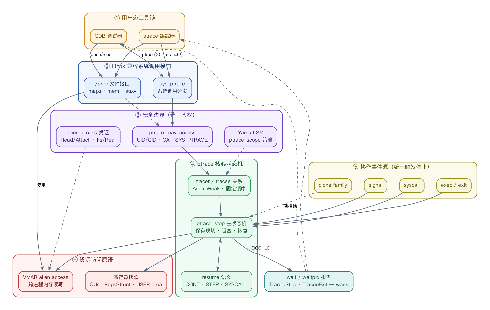

整套调试能力自上而下是一条主干：用户工具（GDB/strace）发出请求，经系统调用接口进入内核，先过权限检查鉴权放行，再交给 ptrace 核心状态机。状态机是整个系统的中枢，负责建立关系、进入 ptrace-stop、向 tracer 报告 wait、再 resume 继续，一旦命中新的停止条件就再次回到 stop。围绕这个中枢，向下分出三类能力：跨进程用户空间读写、寄存器上下文快照、以及与 signal/wait/exec/exit/clone 等系统调用的协作。

> 这是全篇的总框架，后续每页都是其中一个模块的放大。

---

## 第 8 页 — 2.2 ptrace-stop 主状态机：三类停止统一收敛

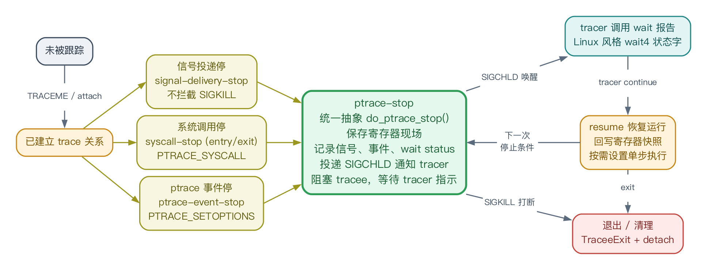

- 生命周期：未被跟踪 → 建立关系 → **ptrace-stop（保存现场）** → wait 报告 → 恢复运行 → 命中下一次停止条件再回到 stop，或退出清理。
- 三种停止来源（信号停、系统调用停、事件停）**统一收敛到 `do_ptrace_stop()`**：同一抽象保存现场、记录 wait status、投 `SIGCHLD`、阻塞 tracee、resume 后回写。

---

## 第 9 页 — 2.3 tracer 与 tracee 如何同步

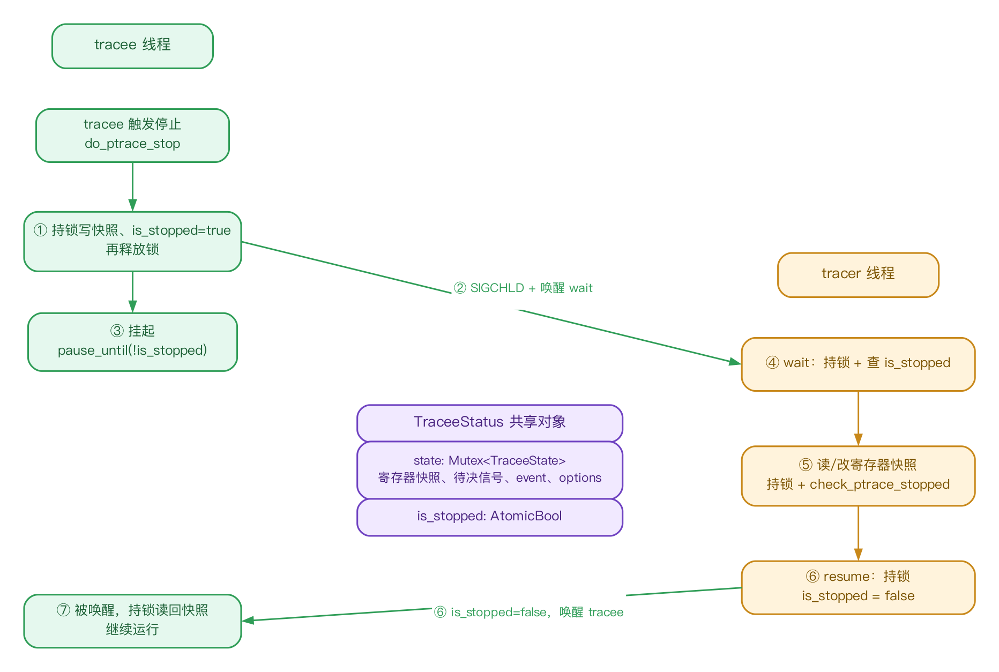

- tracer（调试器线程）与 tracee（被调试线程）通过共享结构 TraceeStatus 同步，其中有一个原子标志和一把互斥锁。
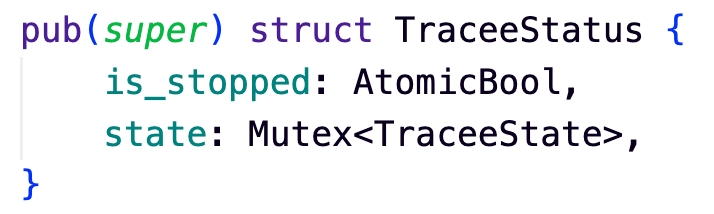
- 原子标志 is_stopped 是 tracee 是否停在 ptrace-stop 的唯一依据：tracee 停下时置真并挂起，tracer 操作前据此确认其已停止、否则拒绝，恢复执行时置假并唤醒。
- 互斥锁 state 保护现场数据（寄存器快照、待投递信号、事件），两线程读写前都先持锁，避免并发竞争。

---

## 第 10 页 — 2.4 跨进程内存访问：在目标进程地址空间里直接读写

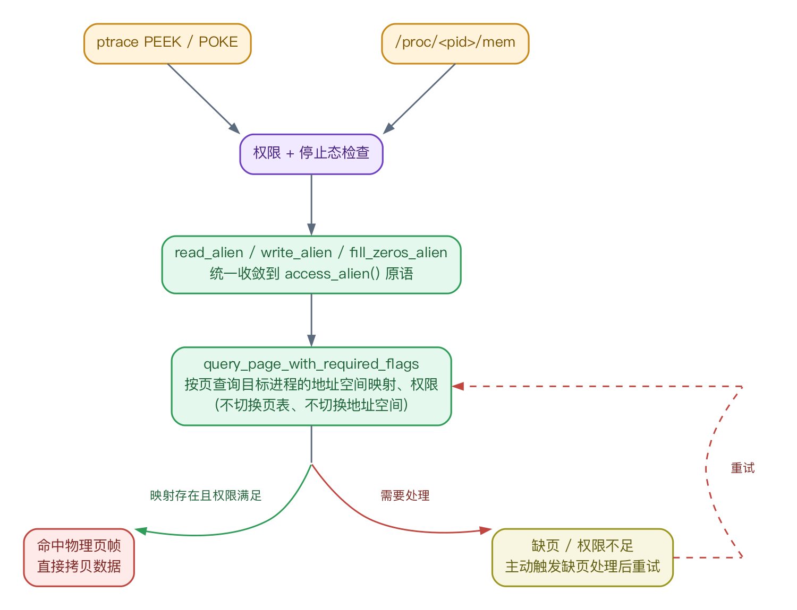

- `ptrace PEEK/POKE` 与 `/proc/<pid>/mem` 走同一套底层读写原语，读写的都是「另一个进程」的内存。
- **不切换地址空间**：不把 CPU 页表切到目标进程，而是直接在它的地址空间里按页定位到物理页帧并拷贝；遇到缺页就主动触发一次缺页处理再重试。
- 整条跨进程读写都夹在统一的读写接口和权限检查边界内，安全可控。

---

## 第 11 页 — 2.5 x86-64 寄存器 ABI：字段级读写策略

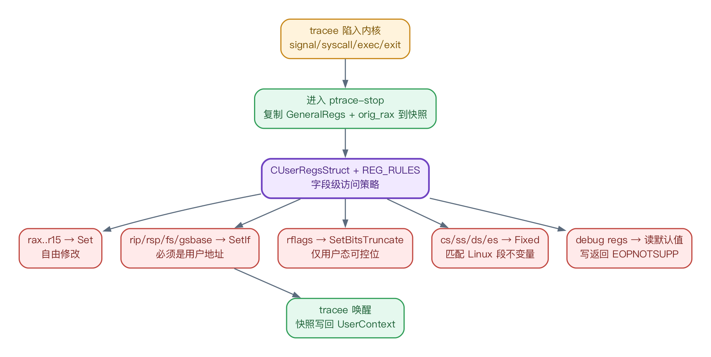

- **快照式访问**：tracee 陷入内核、进入 ptrace-stop 时，持锁把用户寄存器上下文复制成一份寄存器快照；tracer 持锁在快照上按字段修改，tracee 唤醒时再写回——作为 GDB `info registers` 的 ABI 基础。
- **按字段分级管控**：`rax..r15` 由 tracer 自由修改；`rip/rsp/fs/gsbase` 必须是用户地址；`rflags` 仅能写用户态可控位；`cs/ss/ds/es` 段寄存器只读、与 Linux 一致。
- debug 寄存器目前**只读**——满足 GDB 探测、暂不放开硬件断点，后续再支持写入。

---

## 第 12 页 — 2.6 恢复语义与信号四态机

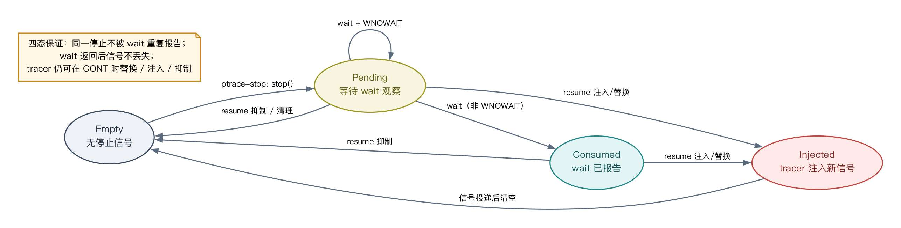

恢复请求：由 tracer 发送，可选择抑制（丢弃）原信号，或注入一个新信号。恢复语义 CONT（普通继续）、SINGLESTEP（设 TF 单步）、SYSCALL（开 syscall 跟踪）三选一。

状态如何被消费：

- tracer 通过 wait 消费 Pending：观察并报告，使其转为 Consumed。
- tracer 通过 GETSIGINFO 消费 Pending / Consumed / Injected：读取对应的 siginfo。
- tracee 在 resume 时通过 re-inject 消费 Pending / Injected：把信号重新投递给自己。

---

## 第 13 页 — 2.7 案例研究：GDB 等调试器的断点是怎么实现的
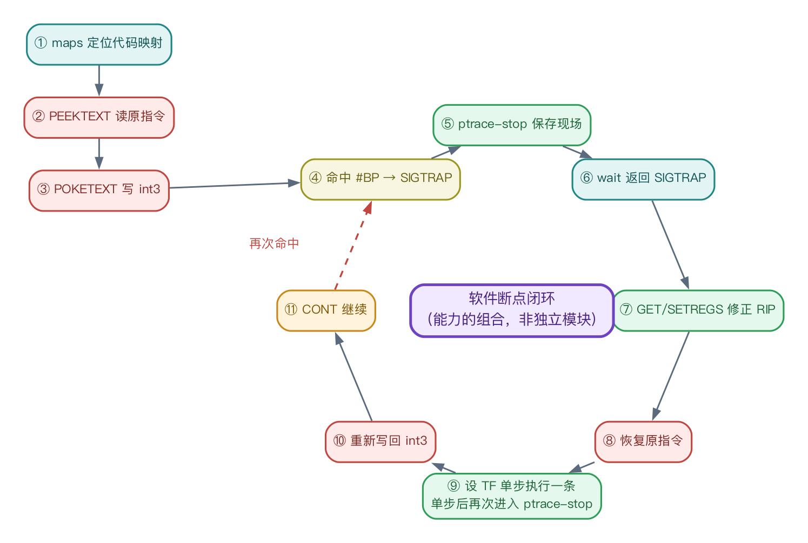

断点是调试器最常用的功能，但它不是单独的内核机制，而是前面这些 ptrace 原语的精确编排。

---

## 第 14 页 — 2.8 安全模型：统一鉴权 + Yama 
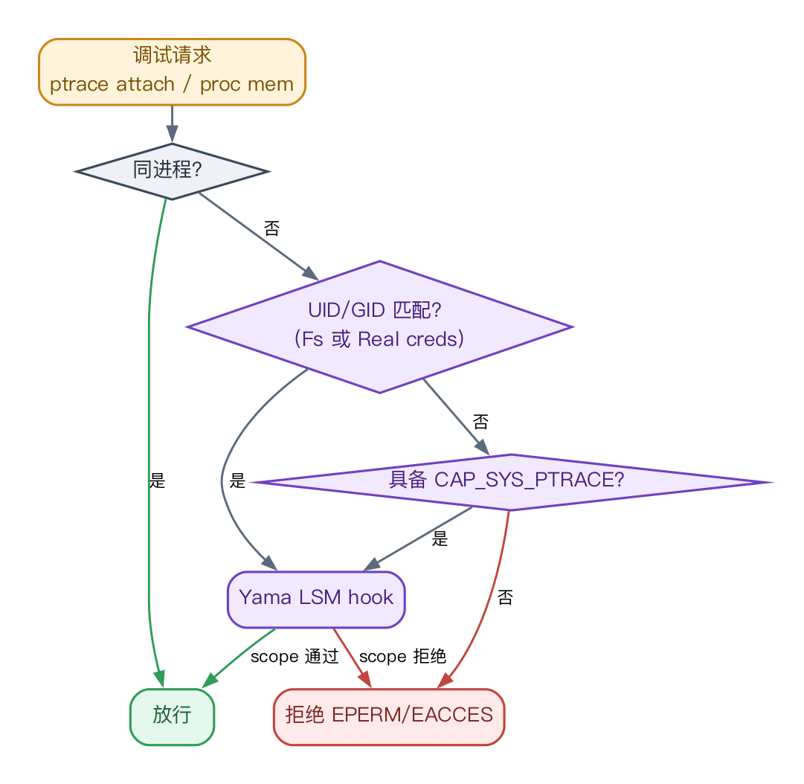

- 统一决策链：**同进程 → UID/GID 匹配 → `CAP_SYS_PTRACE` → Yama LSM hook**。
- ptrace 与 procfs 区分 `Read/Attach`、`Fs/Real creds`，**避免 procfs 绕过**调试鉴权。
- Yama `ptrace_scope` 四档对各放行条件的影响（✓ 放行 / ✗ 拒绝；同进程恒放行）：

| Yama scope | 调用者是其祖先 | 具备 CAP_SYS_PTRACE | 仅 UID/GID 匹配 |
|---|:---:|:---:|:---:|
| 0 Disabled | ✓ | ✓ | ✓ |
| 1 Relational（默认） | ✓ | ✓ | ✗ |
| 2 Capability | ✗ | ✓ | ✗ |
| 3 NoAttach（设置后不可降级） | ✗ | ✗ | ✗ |

---

## 第 15 页 — PART 3 开篇

# PART 3　实现与验证
### 在 Asterinas 上运行真实调试工具，并加入测试体系

---

## 第 16 页 — 3.1 GDB / strace 实机演示

> **此处插入演示视频**（请在 PPT 中嵌入）：在 Asterinas 上真实运行 GDB 与 strace，内容即下方 CI 用例，已纳入持续集成、每次提交自动回归。

**GDB**：CI 用 `gdb -batch` 调一段带断点的 C 程序，逐项校验输出——

- 命中断点，打印调用栈回溯（`#0 hello_world` → `#1 … in main`）
- 打印并修改变量与内存（读 `$1 = 1`、改 `*p = 4321`、内存校验通过）
- 读寄存器（`rip`、`rsp`），继续运行得到正确输出
- 全程**无任何 GDB warning**——说明寄存器/段 ABI 已对齐

**strace**：CI 跑 `strace ls /tmp`，校验完整抓到系统调用序列（`execve()`、`getdents64()` 等）。

---

## 第 17 页 — 3.2 测试与验证方案

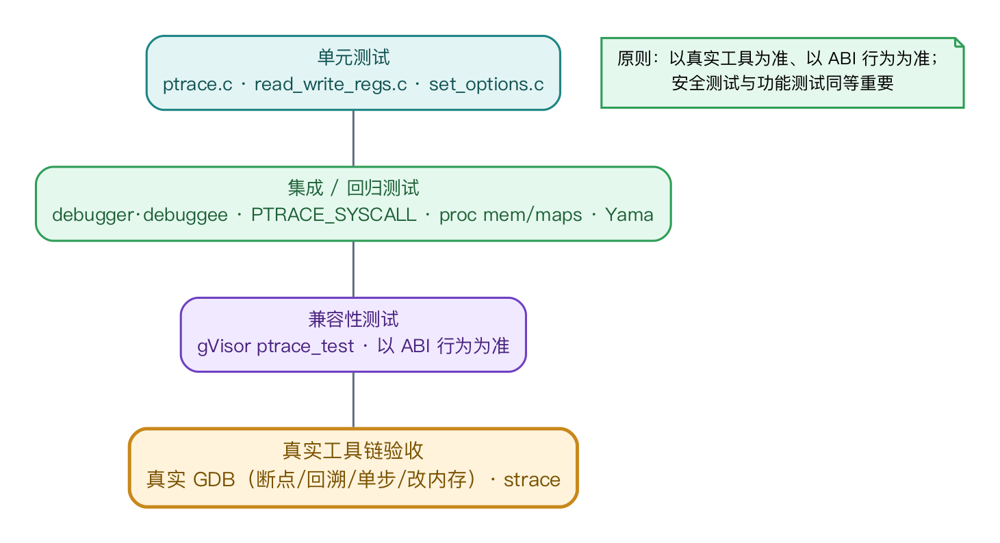

- 金字塔自底向上四层：单元测试 → 集成/回归测试 → 兼容性测试（gVisor `ptrace_test`）→ **真实工具链验收**，越往上越少、越慢、价值越高。
- 顶层以**真实 GDB**（断点/回溯/打印/改内存/单步）与 **strace** 作为最终验收。
- 原则：**以真实工具为准、以 ABI 行为为准**，安全测试与功能测试同等重要。

---

## 第 18 页 — PART 4 开篇

# PART 4　总结与展望
### 成果回顾与后续方向

---

## 第 19 页 — 4.1 总结与展望

**设计核心**　以 **ptrace-stop 状态机**为中心，把信号、异常、系统调用、wait、寄存器、跨进程内存、安全策略统一到一条 **Linux ABI 兼容**的调试路径。

**实现路径**　procfs 视图 → alien access + 安全检查 → ptrace stop/wait/resume 闭环 → 寄存器/单步/断点/options/event/syscall-stop。

**项目价值**　不止「能跑 GDB」——更为 RustOS 建立了**跨越多个内核子系统的调试能力骨架**，同时成为检验进程、内存、信号与安全模型正确性的**综合压力测试入口**。

**后续方向**

- 中途调试已运行进程：支持 `PTRACE_ATTACH / DETACH`。
- 调试多线程进程：fork/vfork/clone 的 event-stop。
- 支持 GDB watchpoint 观察点：x86 debug registers 真实读写。
- 寄存器扩展：`GETREGSET`、FP/SIMD。
- 跨架构推广：riscv64 / loongarch64。

---

## 第 20 页 — Q & A

### 谢谢！　Q & A

> 视觉建议：尾页可缩放放置第 7 页总体架构图作为背景水印，呼应开篇。

---

### 附：图片清单（assets/）

| 页 | 图片 | 主题 |
|---|---|---|
| 4 | `00_background.png` | 研究背景：需求→调试能力→子系统环 |
| 7 | `01_arch_overview.png` | 总体架构通路 |
| 8 | `04_state_machine.png` | ptrace-stop 主状态机 + 三类停止收敛 |
| 9 | `20260617-145625.jpeg` | TraceeStatus 结构体源码 |
| 9 | `04b_sync.png` | tracer/tracee 同步（锁 + is_stopped） |
| 10 | `07_mem_access.png` | 跨进程内存访问 |
| 11 | `08_register_abi.png` | 寄存器字段级策略 |
| 12 | `06_signal_states.png` | 信号四态机 |
| 13 | `09_breakpoint_loop.png` | 断点闭环 |
| 14 | `10_security_model.png` | 安全模型 + Yama |
| 17 | `12_test_pyramid.png` | 测试金字塔 |
| 16 | 演示视频 | GDB / strace 实机演示（PPT 中嵌入） |

> 重新生成所有图：`python3 research_practice/gen_diagrams.py`（需 `brew install graphviz`，字体 PingFang SC）。
