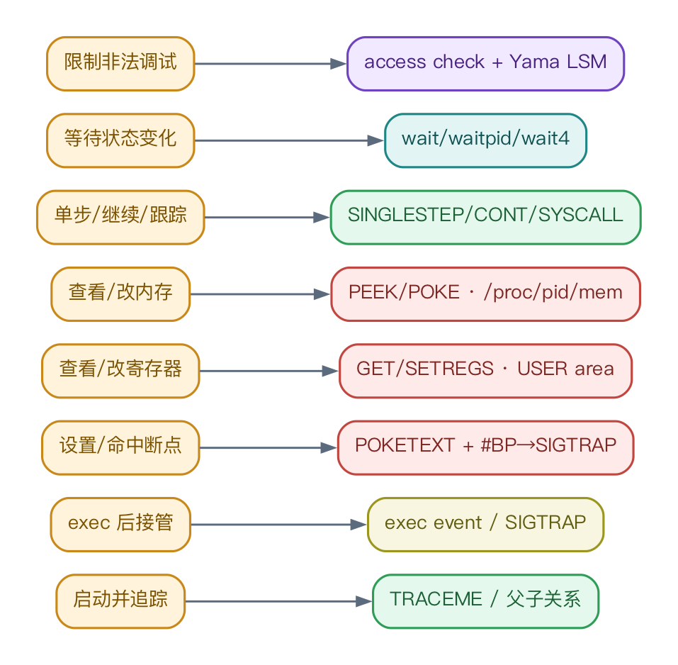
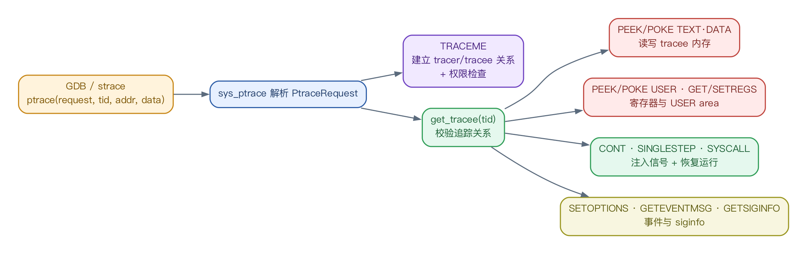
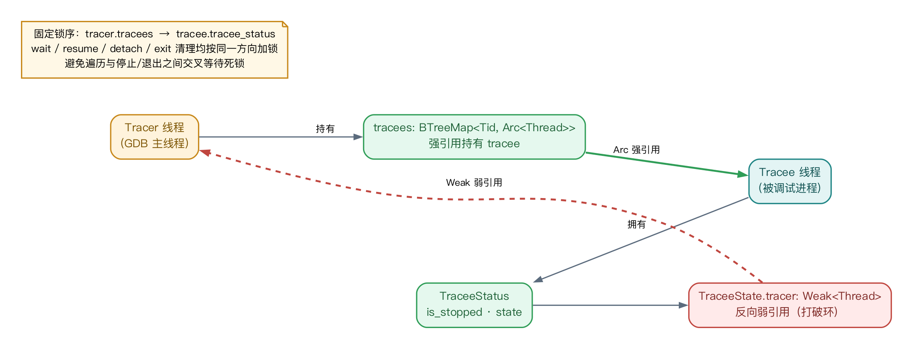
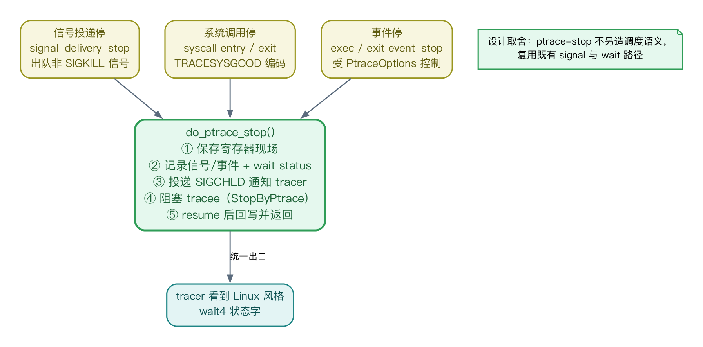
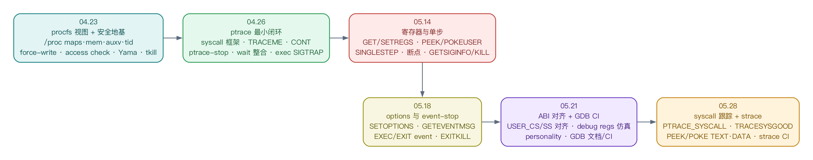

# 面向 RustOS 的进程调试能力构建 — 科研实践答辩（20 页 · 图文版）

> **用途**：科研实践答辩（限时 5 分钟）。每页 = 一张幻灯片：一张精美架构图 + 2~3 条讲解要点，弱化代码细节、强调整体框架。
> **配图**：均由 `assets/*.dot` 经 Graphviz 渲染（`assets/*.png`），可直接拖入 PPT；中文字体 PingFang SC。
> **节奏建议（5 min ≈ 每页 15 s）**：背景/目标 1 页带过，重点讲第 6、9、10、14、15 页（架构、状态机、统一停止、断点闭环、安全），其余快速扫过。
> review 通过后即可一页一页转 PPT。配套 `附录-逐页详稿与代码核对.md` 为讲稿底稿（含源码位置核对），答辩时不展示。

---

## 第 1 页 — 封面

# 面向 RustOS 的进程调试能力构建
### 在 Asterinas 上原生支持 GDB / strace 的 ptrace 子系统

- 2026 全国大学生计算机系统能力大赛 · 操作系统设计赛（全国）
- OS 功能挑战赛道 · proj9
- 汇报人 / 日期 / 指导老师

> 视觉建议：深色科技感封面，中央放一张「GDB ↔ Asterinas 内核」的呼应图标。

---

## 第 2 页 — 目录

| | 章节 | 关键词 |
|---|---|---|
| **PART 1** | 研究背景与目标 | 问题定义 · 验收标准 · 需求拆解 |
| **PART 2** | 核心设计 | 七层架构 · 状态机 · 内存 · 寄存器 · 安全 |
| **PART 3** | 实现与测试 | 进度时间线 · 支持矩阵 · 验证方案 |
| **PART 4** | 总结与展望 | 风险路线 · 项目价值 |

> 视觉建议：四个彩色卡片配图标，与正文配色一致（蓝/绿/橙/紫）。

---

## 第 3 页 — 1.1 研究背景与问题定义

**一句话**：要让 RustOS 撑起真实开发者工具链，「能跑程序」远远不够，必须「能被调试」。

- **生态要求** — Asterinas 要原生支持 GDB、strace 等调试工具，而不仅运行普通程序。
- **调试不是单个 syscall** — 它串联 进程管理 · 信号 · wait · 地址空间 · 寄存器上下文 · 安全策略 · procfs，是一条完整数据/控制通路。
- **核心问题** — 在此前**没有 ptrace 设施**的 RustOS 中，构建足够 Linux 兼容、足够安全、能支撑真实调试器运行的进程调试子系统。

> **目标**：让真实 GDB / strace 在 Asterinas 上原生运行并调试用户进程。
>
> 视觉建议：左侧一排子系统图标（进程/信号/内存/寄存器/安全/procfs）汇聚到中间「调试能力」靶心。

---

## 第 4 页 — 1.2 总体目标与验收标准

**四大目标**

| 目标 | 内涵 |
|---|---|
| ptrace 核心 ABI | 断点 · 停止 · 寄存器/内存读写 · 单步/继续 · syscall entry/exit |
| procfs 调试接口 | `/proc/<pid>/maps`、`/mem`、`/proc/<tid>`、`/auxv` |
| 安全边界 | 对齐 `ptrace_may_access` + Yama LSM `ptrace_scope` |
| 真实工具链验证 | 真实 GDB / strace · gVisor 测试 · 回归 + 安全测试 |

**验收标准（节选）**：GDB 启动并调试单线程程序　软件断点命中 `int3`　读改寄存器/内存　单步与继续　strace 看到 syscall entry/exit　Yama 限制非亲缘访问　纳入 CI

> 视觉建议：右侧做成「清单」勾选动画。

---

## 第 5 页 — 1.3 需求拆解：从调试动作到内核能力

- 左列「用户态调试动作」逐条映射到右列「内核能力骨架」。
- 每个看似简单的调试动作，背后都是一条需要内核补齐的能力链。
- 这张「动作 → 能力」映射，就是后续整套设计的需求来源。

---

## 第 6 页 — 2.1 总体架构：七层调试能力通路 

- **自上而下七层**：用户态工具 → 系统调用接口 → 安全边界 → ptrace 核心状态机 → 协作事件源 → 资源访问原语 → wait 报告。
- **一条主干**：所有协作事件（signal / syscall / exec / exit）统一汇入 ptrace-stop 状态机。
- **一处复用**：procfs 与 ptrace 共享同一套跨进程内存访问与安全鉴权。

> 这是全篇的总框架，后续每页都是其中一个模块的放大。

---

## 第 7 页 — 2.2 系统调用入口：入口薄、状态机厚

- `sys_ptrace` 只做四件事：**解析 request → 定位 tracee → 搬运用户指针 → 委托核心层**。
- Linux ABI 语义被翻译成内核对象方法（`tracee.ptrace_xxx(...)`），入口不理解 wait/信号/地址空间细节。
- 一个统一入口，分流到内存、寄存器、恢复、事件四类操作。

---

## 第 8 页 — 2.3 tracer / tracee 关系与固定锁序

- **正向 `Arc` 强引用**：tracer 通过 `tracees` map 持有 tracee。
- **反向 `Weak` 弱引用**：tracee 仅以 `Weak` 指回 tracer——单向弱引用**打破循环强引用**。
- **固定锁序** `tracer.tracees → tracee.tracee_status`：wait / resume / detach / exit 一致方向加锁，杜绝交叉等待死锁。

---

## 第 9 页 — 2.4 ptrace-stop 主状态机 

- 生命周期：未跟踪 → 建立关系 → **ptrace-stop（保存现场）** → wait 报告 → 恢复运行 → 退出清理。
- 进入停止即保存寄存器现场、记录信号/事件与 wait status，并向 tracer 投 `SIGCHLD`。
- **不另造调度语义**：复用既有 signal 与 wait，`SIGKILL` 可随时打断停止。

---

## 第 10 页 — 2.5 三类停止统一收敛 

- 信号停、系统调用停、事件停——三种来源，**统一收敛到 `do_ptrace_stop()`**。
- 同一出口完成：保存现场 → 记录 wait status → 通知 tracer → 阻塞 tracee → 恢复回写。
- tracer 因此始终看到 **Linux 风格的 `wait4` 状态字**，GDB/strace 无需特殊适配。

---

## 第 11 页 — 2.6 恢复语义与信号四态机

- 恢复请求三选一：`CONT`（普通继续）· `SINGLESTEP`（设 TF 单步）· `SYSCALL`（开 syscall 跟踪）。
- 停止信号用 **Empty / Pending / Consumed / Injected** 四态精确管理。
- 四态保证：同一停止不被 wait 重复报告、wait 后信号不丢失、tracer 仍可在继续时**替换/注入/抑制**信号。

---

## 第 12 页 — 2.7 跨进程内存访问：VMAR alien access

- `ptrace PEEK/POKE` 与 `/proc/<pid>/mem` 共享同一原语 `access_alien()`。
- **不切换页表**：在目标 `VmSpace` 上按页查询映射并直接拷贝 `UFrame`；缺页时 `force` 触发后重试。
- 跨进程读写被封装在 `VmReader`/`VmWriter` 与权限检查边界内，安全可控。

---

## 第 13 页 — 2.8 x86-64 寄存器 ABI：字段级写策略

- 寄存器快照镜像 Linux `user_regs_struct`，作为 GDB `info registers` 的 ABI 基础。
- **按字段分级管控**：通用寄存器自由写；`rip/rsp/fs/gsbase` 必须是用户地址；`rflags` 仅截取用户位；段寄存器固定。
- debug 寄存器**读默认值、写 `EOPNOTSUPP`**——满足 GDB 探测，又不放开硬件断点。

---

## 第 14 页 — 2.9 断点闭环：能力的组合，而非独立模块 

- 软件断点是 **POKE 写代码页 + 异常转 SIGTRAP + ptrace-stop + wait 编码 + GET/SETREGS + SINGLESTEP** 的组合闭环。
- 命中后必须：修正 `RIP` → 恢复原指令 → **单步走一步** → 重新写回 `int3` → 继续。
- 「单步」是关键：否则恢复原指令后同一地址会反复命中。

> 这一页最能说明：调试能力不是堆砌 syscall，而是多原语的精确编排。

---

## 第 15 页 — 2.10 安全模型：统一鉴权 + Yama 

- 统一决策链：**同进程 → UID/GID 匹配 → `CAP_SYS_PTRACE` → Yama LSM hook**。
- Yama `ptrace_scope` 四档：`0 Disabled / 1 Relational（默认）/ 2 Capability / 3 NoAttach`（设置后不可降级）。
- ptrace 与 procfs 区分 `Read/Attach`、`Fs/Real creds`，**避免 procfs 绕过**调试鉴权。

---

## 第 16 页 — 3.1 实现进度：六个里程碑

- 路径清晰：先 **procfs 视图 + 安全地基**，再 **ptrace 最小闭环**，逐步补齐寄存器、单步、options、syscall 跟踪。
- 每个里程碑均已**合入主线**并配套测试（详见附录 PR 清单）。
- 04.23 → 05.28，六周内从「无 ptrace 设施」到「真实 GDB/strace 可用」。

---

## 第 17 页 — 3.2 ptrace 能力支持矩阵

| 类别 | 已支持 | 当前边界 / 后续 |
|---|---|---|
| 追踪与恢复 | TRACEME · CONT · SINGLESTEP · SYSCALL · KILL | ATTACH / DETACH |
| 寄存器访问 | GETREGS · SETREGS · PEEK/POKEUSER | GETFPREGS / GETREGSET |
| 内存访问 | PEEK/POKE TEXT·DATA | 依赖停止态 + alien 权限检查 |
| 事件选项 | SETOPTIONS · GETEVENTMSG · EXEC · EXIT · EXITKILL · TRACESYSGOOD | fork/vfork/clone event-stop |
| 信号信息 | GETSIGINFO · 信号注入/抑制 | 更细 siginfo 对齐 |
| 硬件断点 | debug regs 读默认值仿真 | DR0–DR7 真实语义 |

> 视觉建议：绿色、灰色，一眼看出「已完成」与「规划中」。

---

## 第 18 页 — 3.3 测试与验证方案

- 四层验证：单元测试 → 集成/回归测试 → 兼容性测试（gVisor `ptrace_test`）→ **真实工具链验收**。
- 顶层以**真实 GDB**（断点/回溯/打印/改内存/单步）与 **strace** 作为最终验收。
- 原则：**以真实工具为准、以 ABI 行为为准**，安全测试与功能测试同等重要。

---

## 第 19 页 — 4.1 风险分析与后续路线

| 主要风险 | 具体表现 | 后续路线 |
|---|---|---|
| stop/resume 竞态 | 停止/wait/恢复/退出之间竞态 | 并发压力测试 + 不变量梳理 |
| 锁序风险 | 多把锁交错 | 固定锁序 + 路径审计 |
| ABI 细节 | GDB 对寄存器/段/debug regs 敏感 | 补齐 regset · FP/SIMD · DR0–DR7 |
| 安全绕过 | ptrace 与 procfs 检查不统一 | 统一 access mode · 补 dumpable / PR_SET_PTRACER |
| 多线程/多架构 | clone event-stop、非 x86 ABI 未完整 | 支持 fork/vfork/clone · 推广 riscv64 / loongarch64 |

---

## 第 20 页 — 4.2 总结与展望

**设计核心**　以 **ptrace-stop 状态机**为中心，把信号 · 异常 · 系统调用 · wait · 寄存器 · 跨进程内存 · 安全策略统一到一条 **Linux ABI 兼容**的调试路径。

**实现路径**　procfs 视图 → alien access + 安全检查 → ptrace stop/wait/resume 闭环 → 寄存器/单步/断点/options/event/syscall-stop。

**项目价值**　不止「能跑 GDB」——更为 RustOS 建立了**跨越多个内核子系统的调试能力骨架**，同时成为检验进程、内存、信号与安全模型正确性的**综合压力测试入口**。

### 谢谢！　Q & A

> 视觉建议：尾页可缩放放置第 6 页总体架构图作为背景水印，呼应开篇。

---

### 附：图片清单（assets/）

| 页 | 图片 | 主题 |
|---|---|---|
| 5 | `13_req_decompose.png` | 需求拆解：动作→能力 |
| 6 | `01_arch_overview.png` | 七层总体架构 |
| 7 | `02_ptrace_dispatch.png` | ptrace 请求分发 |
| 8 | `03_tracer_tracee.png` | 关系与锁序（Arc/Weak） |
| 9 | `04_state_machine.png` | ptrace-stop 主状态机 |
| 10 | `05_three_stops.png` | 三类停止统一收敛 |
| 11 | `06_signal_states.png` | 信号四态机 |
| 12 | `07_mem_access.png` | VMAR alien access |
| 13 | `08_register_abi.png` | 寄存器字段级策略 |
| 14 | `09_breakpoint_loop.png` | 断点闭环 |
| 15 | `10_security_model.png` | 安全模型 + Yama |
| 16 | `11_timeline.png` | 进度时间线 |
| 18 | `12_test_pyramid.png` | 测试金字塔 |

> 重新生成所有图：`python3 keyanshijian/gen_diagrams.py`（需 `brew install graphviz`，字体 PingFang SC）。
